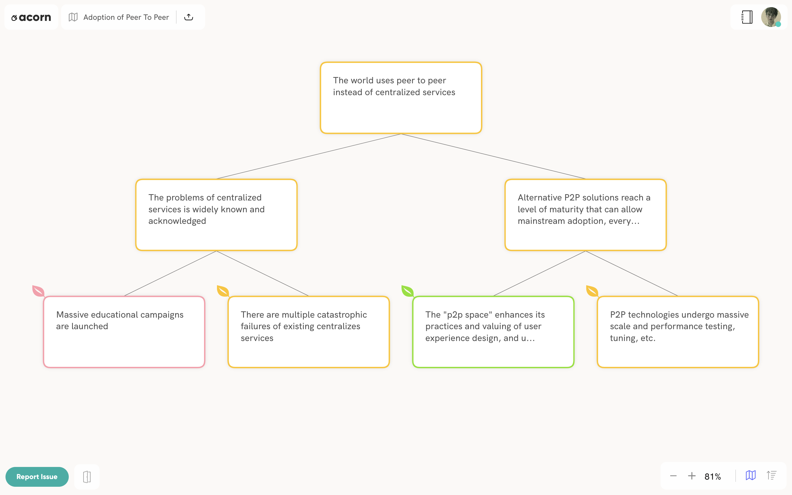
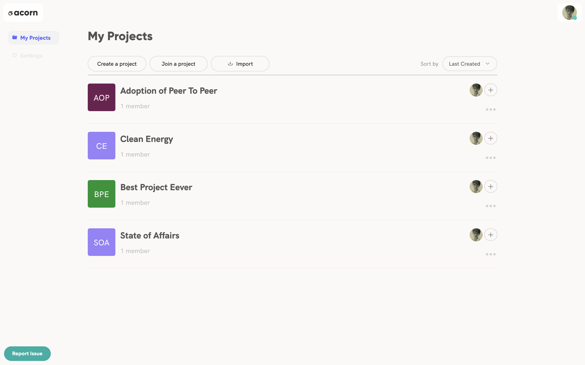

# Acorn

   

### What is Acorn?

Acorn is a way of organizing intended Goals and Outcomes in tree-like structures.  You can think of it as a virtual whiteboard for collaborative planning.

It could have many uses, and [one that it has served is organizing the vision and work allocation of distributed teams of software developers](https://github.com/h-be/acorn-docs/blob/master/vision/Acorn%20(or%20Squirrel).md).  Other uses could be as a personal planning tool, for teams completely aside from software, or anything where linked/inter-related nodes in a structured form would be helpful. 

Prefer a video introduction? [SoA Lightning Talk](https://www.youtube.com/embed/-z47R9wN5SQ?start=53&end=650&autoplay=1)

It is built as a Holochain application, meaning it runs on decentralized peer-to-peer computing and can be used without server infrastructure or a hosting service.  The users of a particular Acorn instance are its hosting power.

### What is Holochain?

Scalable distributed (peer-to-peer) apps with data integrity. [Learn more at holochain.org!](https://holochain.org)

### Why use Acorn?

Acorn creates an Agile process based on the [Deming Plan/Do/Check/Act cycle](https://en.wikipedia.org/wiki/PDCA), that is less bound to some of the traditional dependencies of Scrum and more applicable to projects and organizing beyond software development.  The patterns Acorn enables and the resultant State-of-Affairs trees are scalable, handle complexity and uncertainty, and work with distributed groups.

Scrum, the roles of Scrum Master, Product Owner, and Devs, and the embodied tools of Kan-Ban and ticketing linked to git based source control, feel like a defacto standard in software development.  For projects (software or otherwise) or organizations that do not find this model to be appropriate, or are finding it limiting, Acorn may provide a good alternative.  If you or your group have not used Scrum but are considering it, we welcome you to try Acorn first.

[Learn more about the vision and theory behind Acorn.](https://github.com/h-be/acorn-docs/blob/master/vision/Acorn%20(or%20Squirrel).md)

### Who should use Acorn?

Acorn could work for individual organizing, and has been used with dozens of team members on globally distributed teams.  It can be used by anybody who has a vision for the future and wants a process for reaching closer to that ever evolving vision.

### What devices will Acorn work on?  Can I use it?

There are standalone packages for macOS and Linux.  It also could be run within the Holoscape hApp environment.

Windows users should look at alternatives with Virtual Machines or via Holo in a browser.  We hope and expect it will be hosted by HoloOS nodes as those come online for Holochain apps.

To learn more, please [explore our documentation](https://github.com/h-be/acorn-docs/) or [download and install a working prototype version on macOS or Linux](https://github.com/h-be/acorn-release/releases/). The app also has an intro guide when you start it for the first time!

### Is it Open Source?

Yes, all the code and documentation is available in these repositories:
* [acorn](https://github.com/h-be/acorn)
* [acorn-docs](https://github.com/h-be/acorn-docs) - Documentation across and about Acorn

At writing, in addition to the many self created or open files, there are a small number of image files that have been licensed (by [Harris-Braun Enterprises, LLC](https://harris-braun.com) from nounproject.com and iconfinder.com) for use in Acorn.  We believe those would need to be replaced in a fork.  The Acorn team intends to replace these licensed images with completely free alternatives as soon as feasible. 

Please consult [our ATTRIBUTION file](https://github.com/h-be/acorn-docs/blob/master/ATTRIBUTION.md) for full details including other images, code, and prior work.

### What license is Acorn under?  Why?

This release is under the [Cryptographic Autonomy License v1.0-Beta 4](https://github.com/holochain/cryptographic-autonomy-license) (CAL), currently [under review by the OSI](http://lists.opensource.org/pipermail/license-review_lists.opensource.org/2019-December/004455.html).  **The license will be updated to the final version upon approval by the OSI.**

CAL was created for the Holochain project to protect both source code and user data from restriction.  It frees an end user from having their data held from them by a party that develops or hosts software licensed under CAL.

### Who developed it?

Acorn was [envisioned](https://github.com/h-be/acorn-docs/blob/master/vision/Acorn%20(or%20Squirrel).md) and prototyped (using a third party platform) by the Holochain core development team in 2018 to organize their own planning and execution process.

In August 2019 [Sprillow](https://sprillow.com) undertook a design process and began building Acorn on Holochain.  Contributors can be seen in our [Holochain repo](https://github.com/h-be/acorn-hc/graphs/contributors), our [UI repo](https://github.com/h-be/acorn-ui/graphs/contributors), for [documentation](https://github.com/h-be/acorn-docs/graphs/contributors), and [releases](https://github.com/h-be/acorn-release/graphs/contributors).

Please consult [our AUTHORS.md file](https://github.com/h-be/acorn-docs/blob/master/AUTHORS.md) for a list of contributors and their organizations.

The team has been hosted and supported by [Harris-Braun Enterprises, LLC](https://harris-braun.com).

### What are future plans for Acorn?

Acorn is being developed on a regular basis. The alpha version is out soon. [Join our waiting list here](https://forms.gle/8QCNveDnDGwaWLoa7) and we'll invite you in to the first external alpha testing group!

You can also join [the open discussion on the Holochain forums](https://forum.holochain.org/c/projects/acorn/106), or [the development chat channel](https://chat.holochain.org/appsup/channels/acornstateofaffairs). ([let us know](mailto:info@harris-braun.com?chat.holochain.org%20invitation) if you need a chat.holochain.org invitation)

This is an open source project, please contribute!

### Having trouble? Report an issue!

Please [submit an issue with your experience](https://github.com/h-be/acorn-release/issues/new) and include as much detail as possible including log(s), screenshot(s), and reproducing steps.  You can also make feature suggestions as issues, or come discuss them at [the forum](https://forum.holochain.org/c/projects/acorn/106) or [chat channel](https://chat.holochain.org/appsup/channels/acornstateofaffairs).

## License

Copyright (C) 2021, Harris-Braun Enterprises, LLC

