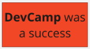
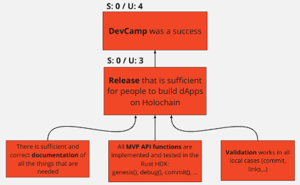
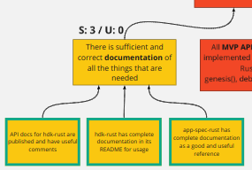
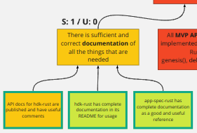
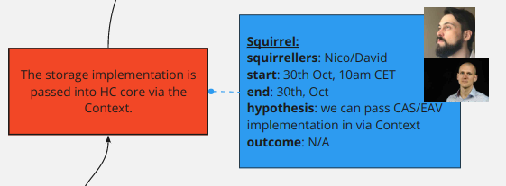

## Acorn (or Squirrel)

An Agile Development Pattern for Distributed Teams 

using State-of-Affairs trees.

### Context

The Holochain Core Dev Team spent a year using a pretty standard version of Scrum with its phases of Sprint Planning, Sprint, Review & Retrospective; the roles of Scrum Master, Product Owner, and Devs; and the embodied tools of Waffle for Kan-Ban and Github ticketing and SCM. In our context this process failed to deliver on the success some organizations experience.  We think this happened for a number of interrelated reasons, but mostly because of the combination of the incomplete fulfillment of the Product Owner role, the complexity of architecting Holochain itself with the distributed nature of our team across time-zones.  This made it very difficult for us to land some of the key things that make scrum work: clarity of work in the form of a prioritized backlog and meaningful ticket estimation.  Thus we never once completed all the tickets we put into a sprint.

At our Montreal HodlPodl we took a step back to think through how we could create an Agile  process that is still based on the [Deming Plan/Do/Check/Act cycle](https://en.wikipedia.org/wiki/PDCA), but that would meet the actualities of our circumstances.  This pattern and the new embodied form of the State-of-Affairs tree is the result of that work.

### Theory

Acorn is built out of the following core notions:

1. **The Tree:** We continuously evolve a shared representation of the development task at hand in the form of a dependency tree (technically a DAG) of intended outcomes, (or what we also call "states-of-affairs" in that the nodes of the tree describe a desired state of the world)

2. **Attributes:** We attach attributes to nodes, including:

    1. Complexity State: this is most important and required attribute for all nodes.  A node can be in one of four simple states that describe what we know about the complexity of bringing that state-of-affairs into existence:

        1. Unknown: we don’t know what it will take or how long it will take

        2. Big: it will take one Dev more than one day to achieve the intention

        3. Small: it will take one Dev at most one day to achieve the intention

        4. Done: the state-of-affairs now exists in the world!

    2. Interest: every user can express their interest in a specific state-of-affairs and thus add their perspective to the importance and hence priority of it. We might have different perspectives on priority which is why it is of benefit to represent each user’s interest in items instead of having one aggregate value. 

    3. Assignee: a Dev who is working on the node in some way or another (see verbs below

    4. Other attributes: links to tickets or PRs on github, links to Squirrel outcome videos, etc.

3. **Verbs:** We talk about modifying the tree using these verbs:

    5. **Intend** (+U): To intend is to add nodes to the tree, to declare our intended vision of what the world will look like.  Such nodes will almost always start as Unknowns, thus we denote this with +U.

    6. **Breakdown** (U->U*): Initially it’s usually fairly simple to break down an intention of unknown complexity to a number of smaller unknowns, thus we denote this as a transformation: U->U*

    7. **Understand** (U-> B+S*): At some point we are able to flesh out an intention into a set of leaves which are all Smalls.  At this point we can say we have understood the complexity of the intention, so we convert the Unknown to a Big and we denote this with the transform: U-> B+S*

    8. **Reduce** (-S):  Reducing the tree is to do the work described in a Small thus we denote it with -S or subtracting Smalls from the tree (by marking them as done).  Some renderings could just hide them, others could show them in a different color.



    9. **Prune** -x*: Pruning is when we realize that we were wrong (for whatever reason) and that we don’t actually want to retract an intention so we cut it from the tree and denote this as -x because it could be any set of nodes or branch.

    10. **Arrange**: It can be useful to display a tree by ordering the nodes from left-to-right by Importance or Priority.  Thus you can think of prioritizing as arranging the tree. 

4. **Prediction:**  There are a number of opportunities for measuring the evolution of the tree that will enable the team to make useful predictions:

    11. A core intention of Acorn is to allow for throughput analysis of the team’s ability to convert Smalls into reality over time, i.e. answer the question "How long will it take?".  If we know the average rate at which the team can reduce Smalls, we can quite accurately predict, at the least a lower bound, of an intention simply by counting the number of Smalls in its branch.  In our circumstances we feel pretty clear that this produces a form of estimation that is simply a natural outcome of “Understanding,” and leverages the reality that, for our dev team anyways,  the accuracy and utility of any estimation drops off very quickly for any intention that takes more than a day to deliver on.

5. **Squirrels (formalization and visibility of ongoing work):** Understanding the actual dependencies and the complexity of realizing an intention takes substantial work, as does the implementation of intended state-of-affairs.  The doing of this work needs to be reflected in the tree. We use the term **Squirrel** for the formalized process and representation of a person or small team taking on doing the Breakdown and Understanding of an intention and the implementation of it. Basically everything that takes some time to deliver and thus binds resources should be formalized and represented by a Squirrel. A Squirrel on the tree consists simply of:

    12. The squirrellers (i.e who’s doing the work)

    13. A hypothesis (an idea of what the exploration is intended to answer).

    14. A time-frame (how long the squirrel is expected to run)

    15. An outcome (when complete)

This allows us at a glance to see who’s working on what and a sense of what they intend to accomplish in regard to the given intention.  The framing of hypothesis and outcome, allows us another opportunity for self-reflection, and we can check our hypothesis against outcomes.  We create Squirrels for three of our verbs that are important to measure:

* Reductions: where the hypothesis is simply that we can accomplish the reduction in the given time-frame.

* Breakdown and Understanding: where the hypothesis is an approach to converting the Unknown to Bigs & Smalls.  This may take the form of a coding Spike, of doing research into available crates, algorithm design, meetings, etc.  The main point about documenting Understanding as a Squirrel is that it communicates to the team in our embodied form what’s happening, regarding understanding complexity as well as an estimated time frame for completing that understanding

[Commentary: In designing Acorn, one of the key problems we wanted to overcome was the lack of satisfactory agility in the Scrum process for discovery and understanding of complexity. In Scrum this would typically happen during Sprint Planning, when the whole team takes the prioritized backlog and moves a subset of the tickets into the Sprint which then the whole team commits to work on to completion.  In our context, because of the distributed multi-time-zone nature of the team, sprint planning was difficult to achieve and this whole-team start stop did not work well. So one way of understanding Squirrels is to regard them as *mini sprints* for subsets of the team that are created to communicate with the rest of the team and thus enable holopticism and feedback. ] 

### Practice

Using the notions described above, it’s pretty easy for a distributed team to work asynchronously on the tree and coordinate substantial action.  However there’s no substitute for whole team synchronous coordination.  Obviously there are many possibilities for how to arrange this, but what we have currently decided for our team is to simply operate with daily 1 hour heartbeat calls that work for a substantial percentage of the team to join as possible by time-zone.  These heartbeats are loosely structured and we break them into different flavors according to the need:

1. Squirrel Reporting: talking about Squirrel results (though we have also taken on the practice of recording short videos of our outcomes so people can review them asynchronously)

2. Tree grooming: which consists of updating the tree, doing Intending, Pruning, Breakdown, etc

3. Meta: which consists of what would happen during retrospective in scrum, i.e. looking at the Acorn process itself and how its working.  So far we have done this after completing a substantial branch of the tree.

4. Demo Party Planning:  We have not yet done this, but our intention is to merge the results of Squirrel Reporting into a shareable artifact for the wider team.

[Commentary: Scrum involves some practical meeting forms that help move things along within the form.  Standup is one of the key forms during a Sprint that helps devs synchronize around the embodied form that holds the shared status, usually a Kan Ban board of some type. Review, retrospective, sprint-planning, ticket grooming, estimation, are other named meeting types that we held. Revelation - For our team, we found that short standups aren’t sufficient for synchronization of our distributed team.]

### Vision and Evolution

Note from the Hodl-Podl

#### Aperspectival OpenSource Coordination

One of the key things we see possible with Acorn is it’s potential for better coordinating Open Source projects.  We see a few key aspects to making this happen:

1. Multi-perspective trees:  There is no reason why there should just be one tree.  In fact in our envisioned implementation each person maintains their own view on the tree (like git), and the interesting part comes in processes for merging state changes and/or linking new branches into a commonly held view of the tree.  There are lots of opportunities for UI and rendering of these multi-perspective trees, similarly to the way we use GUI renderings of branches in git.

2. Public trees: publishing our SoA tree is a very powerful way to make visible the state of thinking of a team, and therefore create surface area for contribution. Assuming a multi-perspective interface exists we easily imagine the equivalent of creating pull requests, but for changes to the tree, rather than code changes.  Thus the community at large can explore and visualize multiple solutions to particular Unknowns on the tree.

3. Attributes enhancements:  The ability to add attributes onto tree nodes we are sure will be used for lots of important purposes, i.e. community "voting" on importance of given intentions.

#### Recurring States

We are also working on adding distinctions that help define and clarify recurring states-of-affairs, for example an intention like "We have a smoothly operating Dev process" is state that may oscillate back and forth between existing in the world and not, and also be a matter of opinion, so it wouldn’t go “Done” but be marked variably by an aggregate measure of opinion.  

### Scrum vs Waterfall vs Acorn

The Deming Circle of Plan/Do/Check/Act, upon which Scrum is based, offers to software development teams a process with distinct phases that creates clarity on a team for action by protecting the development team from unrealistic demands of a product owner while at the same time providing measurable throughput of task completion during sprints such that the product owner can have a realistic sense of when features can be delivered.  As compared with the Waterfall process, which has a very long planning cycle where all the dependencies are charted out and a full specification is written before work begins, it has the advantage of continuous deployment of a "working" product from the beginning.  Waterfall has the advantage of very clear and detailed up-front scoping and specification before development “work” begins, especially for large scale projects where coming to agreement on costs ahead of time is a major concern. Perhaps we can think of Acorn as a middle way, where clarifying scope and understanding dependencies (specing) gets mixed into the explicit process of the developers, but this is done in smaller agile cycles.

